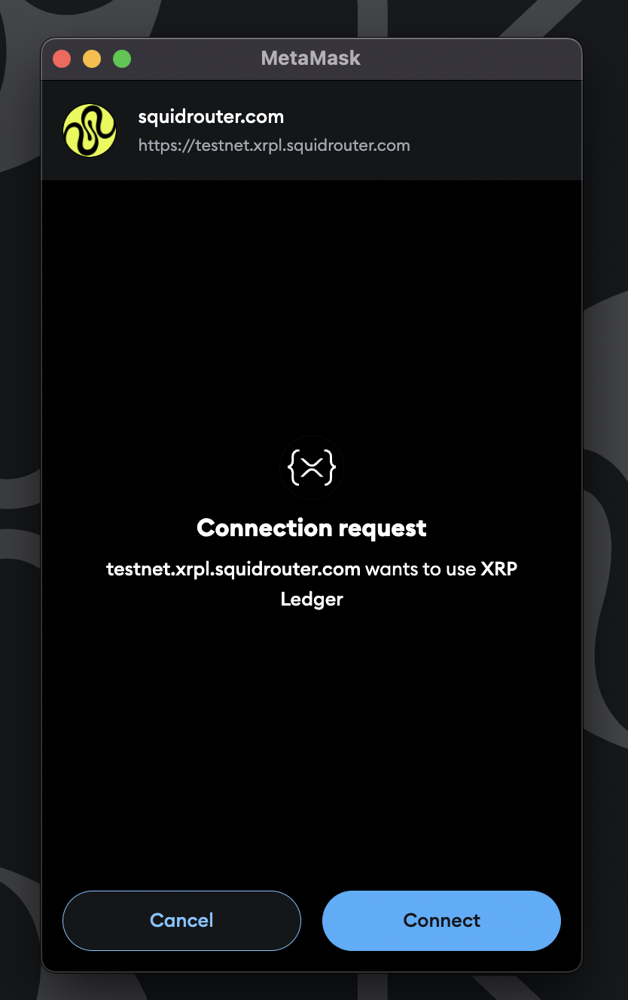
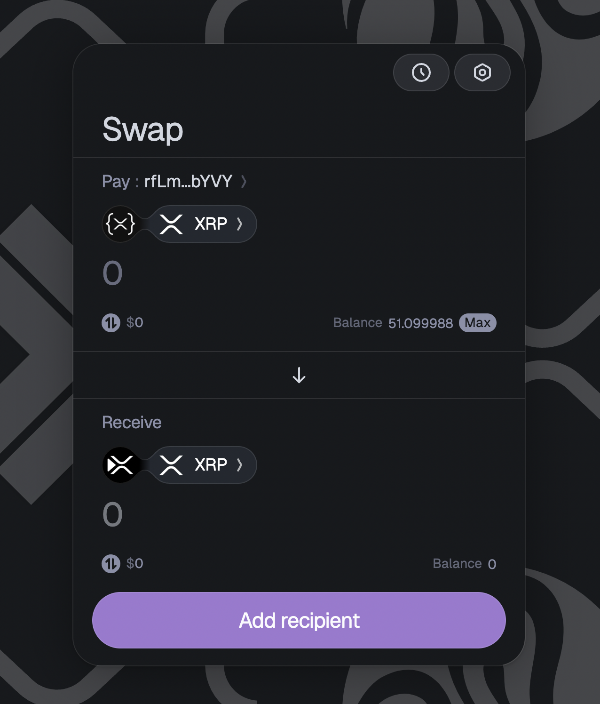
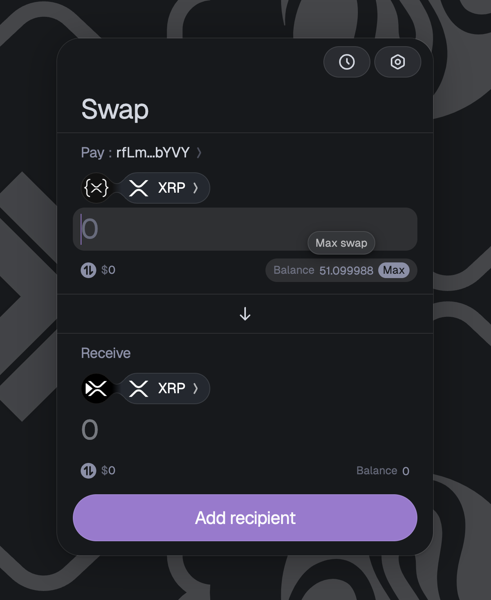
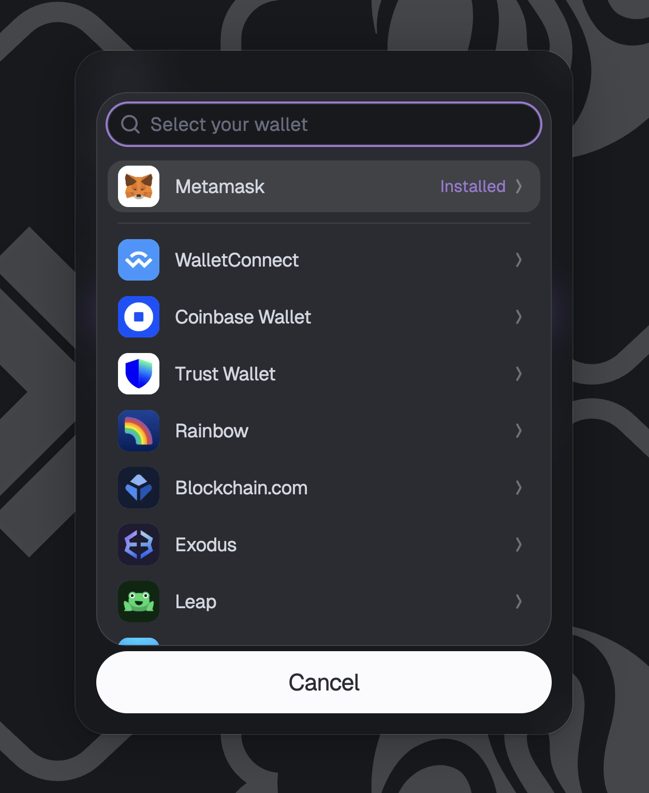
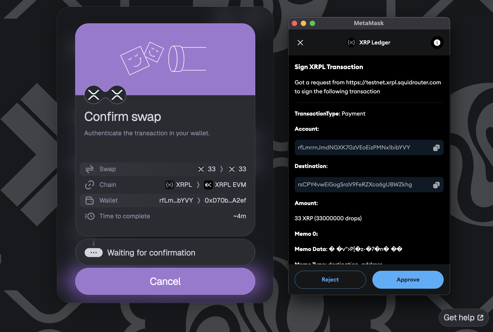

# Using the Bridge

The Axelar Bridge is a vital component for interacting with multiple blockchain networks, seamlessly connecting users across the XRPL ecosystem and beyond. In this guide, you’ll learn about the core functions of the bridge and how its user interface adapts depending on whether you are on Testnet or Devnet.

**Understanding the Axelar Bridge**

The Axelar Bridge enables cross-chain interactions by allowing assets to move securely between XRPL, XRPL EVM, and other connected chains. It serves as the backbone for interoperability in both Testnet and Devnet environments, though each setup comes with its own unique characteristics.

**Testnet vs. Devnet: Key Differences**

- **Testnet Bridge (Powered by SquidRouter):**  
  The [Testnet version of the bridge](https://testnet.xrpl.squidrouter.com/), developed by [SquidRouter](https://www.squidrouter.com/), supports connectivity across all Axelar testnet-connected chains. This robust solution not only facilitates interactions between XRPL and XRPL EVM but also extends support to various other blockchains. For XRPL connectivity, users can employ the XRPL MetaMask Snap (developed by Peersyst) or use the Crossmark.io desktop extension wallet. Additionally, when connecting to the XRPL EVM Testnet, you can use MetaMask via Wallet Connect. Simply add the following [XRPL EVM Testnet network configuration](./getting-started/connect-to-the-xrpl-evm.md#adding-xrpl-evm-to-metamask) to your wallet:  

- **Devnet Bridge:**  
  The Devnet environment features a simpler setup. Here, the XRPL wallet functions as a faucet—meaning you cannot connect to it directly. Instead, connectivity to the XRPL EVM Devnet is achieved via MetaMask.

Follow this interactive guide by answering the questions below:

---

**Which test network do you intend to bridge on?**


   

   **Do you have a MetaMask account?**

      
         

            **Have you installed the XRPL Snap on MetaMask**

            
               

                  Then lets get to bridging:

                  Visit the [squidrouter bridge](https://testnet.xrpl.squidrouter.com/)

                  By default the XRPL will be selected as source chain and the XRPL EVM will show up as the destination chain. In between there is an arrow pointing down, which when hovered on top with the mouse will switch to point up allowing the user to flip tokens, making the XRPL EVM the source and the XRPL the destination chain.

                  **Which chain do you intend to swap from?**

                  ### From XRPL to XRPL EVM:

                  #### 1. Connect your XRPL Wallet
                  
                  Click on **Connect**

                  

                  Choose your XRPL Wallet

                  

                  Sign the request to connect your XRPL Wallet with squidrouter.

                  
                  

                  Congratulations, first step completed! As you can see in the image the account "rfLm...bYVY" is now connected.

                  

                  #### 2. Select the amount to swap.

                  By hovering the mouse on top of your **Balance** and the **Max** button element you can select all your XRPL available drops. 

                  

                  **Type** or **paste** your desired swap amount instead.

                  

                  #### 3. Set the receiver:

                  Click on **Add recipient** to introduce the XRPL EVM destination address.

                  

                  Connect your XRPL EVM account with any Wallet Connect compatible wallet or paste the XRPL EVM receiver address.

                  
                  

                  #### 4. Transfer

                  Press **SWAP** to start the cross-chain bridge transfer of **XRP**.

                  

                  **Review** and **Approve** the transaction request sent to your XRPL Wallet.

                  
                  

                  #### 5. View your XRP on the XRPL EVM Testnet

                  [**Add XRPL EVM Testnet**](./getting-started/connect-to-the-xrpl-evm.md#adding-xrpl-evm-to-metamask) Network to MetaMask if you havn't yet.

                  ### From XRPL EVM to XRPL:

                  1. Connect your XRPL EVM Wallet with Wallet Connect.

                  2. Select the amount to swap.

                  3. Set the receiver:

                     Choose the XRPL Wallet and Connect or paste the XRPL receiver address.
                  
                  4. Press "SWAP" to start the cross-chain bridge transfer of assets.

               

               

                  The [**XRP Ledger Snap**](https://snap.xrplevm.org) is an innovative extension designed to seamlessly integrate the XRP Ledger (XRPL) into your MetaMask wallet. With this [MetaMask Snap](https://snaps.metamask.io/snap/npm/xrpl-snap/), you can manage XRP and other tokens on the XRPL, perform transactions, and interact with XRPL-based decentralized applications (DApps) directly from the familiar MetaMask interface. This extension enhances your cryptocurrency experience by bringing the power of the XRP Ledger to the widely-used MetaMask ecosystem.

                  Learn how to install the XRPL snap on your MetaMask by following the official [**Get Started**](https://snap-docs.xrplevm.org/getting-started/quick-start) guide, visit the [Snap landing](https://snap.xrplevm.org) or start directly from the [Snap Wallet UI](https://wallet.xrplevm.org).

                  Another XRPL Wallet option to use when connecting XRPL accounts to Squidrouter bridge is Crossmark. [**Crossmark**](https://crossmark.io) is a browser-first, non-custodial XRPL wallet which as MetaMask is also available for Chrome, Firefox and OperaGX. It too integrates with the SquidRouter-powered Testnet bridge. With Crossmark, you control your private keys locally and manage your accounts using customizable Cards and multiple Profiles across mainnet, testnet, or devnet. Robust security audits ensure your funds remain safe as you navigate the XRPL ecosystem.

               
            

         

         

            Learn how to create your first account on the **#1** most used crypto wallet. [Install MetaMask](./getting-started/install-metamask.md)

         
      

   
   

   ## Axelar Bridge (Devnet)

   With the Axelar Bridge, developers and users can:

   - **Obtain test XRP** on XRPL without a dedicated XRPL wallet.  
   \- You can see the XRPL account’s seed in the browser’s Local Storage (Right-click → Inspect → Application → Local Storage).  
   - **Bridge tokens** between XRPL and XRPL EVM (Testnet or Devnet) for dApp development and experimentation.  
   - **Seamlessly move assets** across chains, enabling advanced cross-chain functionality and interoperable applications.

   The Axelar-powered bridge also supports **bidirectional** transfers between the **XRPL Devnet** and the **XRPL EVM Devnet**. Similar to Testnet, XRPL Devnet accounts are self-funded for outgoing transactions, while transfers **from** XRPL EVM **to** XRPL require signing via MetaMask.

   ### Steps to Use the Axelar Bridge (Devnet)

   1. **Open the Axelar Bridge**  
      Visit [https://bridge.xrplevm.org/](https://bridge.xrplevm.org/)

   2. **Set XRPL Devnet as the Source Chain**  
      - Select **"XRPL Devnet"** as the source chain.
      - Select **"XRPL EVM Devnet"** as the destination chain.  
      

   3. **Select or Fund a Devnet Account**  
      - If you need test XRP on the XRPL Devnet this acts as a faucet by generating new funded accounts with 100 XRP.
      

   4. **Connect Your Wallets**  
      - **XRPL Devnet**: No separate XRPL signature is required for outgoing transactions.
      - **XRPL EVM Wallet**: Connect MetaMask with network set to **XRPL EVM Devnet**.  
      

   5. **Choose a Token and Amount**  
      - Select **XRP**, IOUs, or an ERC20 token supported on Devnet.
      - Enter the desired amount to bridge.  
      

   6. **Transfer and Confirm**  
      - Outgoing from XRPL? No XRPL signature needed. Outgoing from EVM to XRPL? Sign with MetaMask.
      - Monitor status in the [Axelar Devnet Amplifier Explorer](https://devnet-amplifier.axelarscan.io/).  
      

   7. **Verify the Transaction**  
      - After completion, a success message appears.
      - Check the [XRPL EVM Devnet Explorer](https://explorer.xrplevm.org) for transaction details.  
      

   
